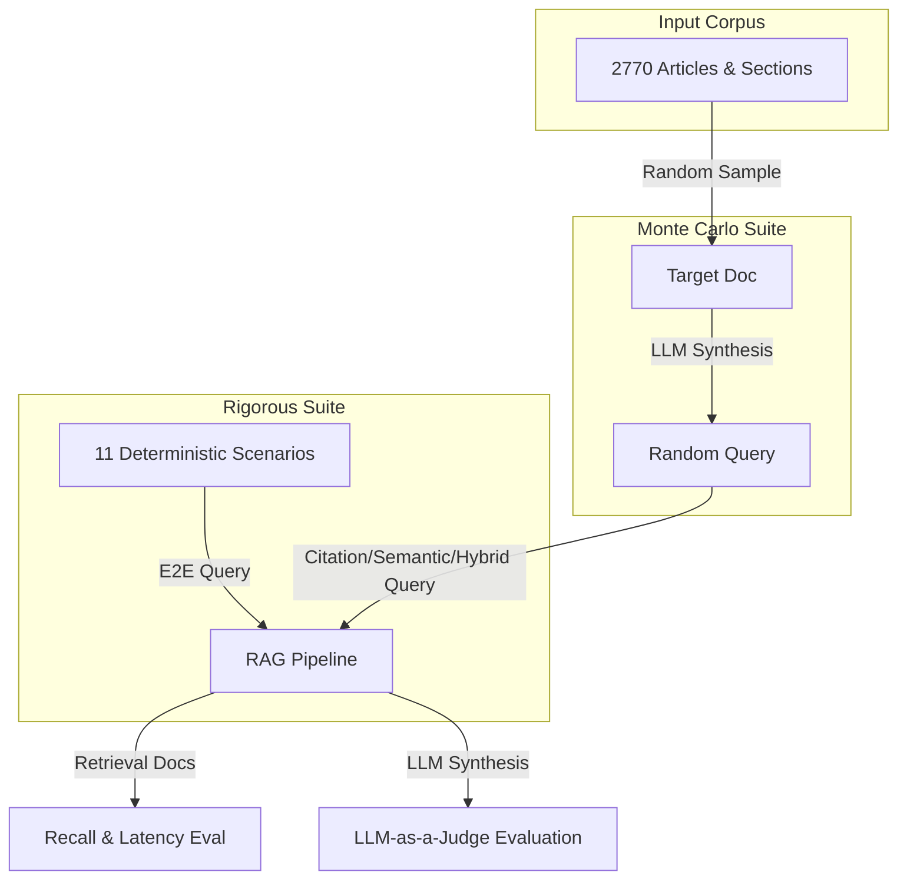

# 🧪 RAG Evaluation & Testing Methodologies

This document serves as the **core reference ledger and design brain** for the testing logic implemented in the **Bharat Samvidhan AI** RAG assistant. It outlines the testing philosophies, retrieval metrics, judgment paradigms, and execution pipelines used to ensure legal precision and speed.

---

## 📌 1. Testing Philosophy & Approaches

We validate the RAG pipeline using a dual-testing model: **deterministic evaluation** (fixed-case scenarios) and **stochastic verification** (Monte Carlo random-sampling). This hybrid approach checks for both consistent correctness on known edge-cases and robustness on unseen arbitrary scenarios.

### 1.1 Fixed-Case Evaluation (`run_rigorous_tests.py`)
This suite tests **11 deterministic legal scenarios** targeting specific critical capabilities:
* **Constitutional Rights**: Suspension of rights during emergency, detention rules.
* **Statutory Crimes & Penalties**: Theft definitions, murder exceptions, defamation limits.
* **Hybrid Retrieval**: Complex queries requiring simultaneous Constitutional and Statutory context.
* **Conversational Context**: Multi-turn dialogue queries containing relative pronouns (like "it", "this") that require query reformulation.
* **Personalization & Memory RAG**: Queries utilizing pre-injected memory profiles.
* **Safety & Policy Bypass**: Attempts to request illegal blueprints (e.g., how to bribe an official or organize a rebellion).

### 1.2 Monte Carlo Stochastic Evaluation (`monte_carlo_test.py`)
This suite performs high-volume automated testing on a randomized subset of the corpus:
1. **Document Sampling**: Randomly selects a source document from the 2,770 database chunks.
2. **Query Generation**: Synthesizes a query utilizing one of three structures:
   * *Citation Query*: "What is Article X?" / "Explain Section Y."
   * *Semantic Query*: Extracts a key legal phrase from the document and wraps it in a topical template (e.g., "What does the law say about [phrase]?").
   * *Hybrid Query*: Combines explicit citation with key semantic phrase details.
3. **Retrieval Verification**: Queries the RAG retriever and measures whether the source document was successfully recalled.

---

## 📊 2. Evaluation Metrics: Retrieval & Generation

We evaluate quality and latency across both the retrieval stage and the synthesis stage:

### 2.1 Retrieval Stage Metrics

#### A. Citation Recall
Retrieval success is measured via **Citation Recall**, which evaluates if the target sections or articles are returned within the top $K$ results.

$$\text{Recall} = \frac{|R \cap E|}{|E|}$$

Where:
* $R$ is the set of retrieved articles/sections (e.g., `["21", "22", "300"]`).
* $E$ is the set of expected/ground-truth citations defined in the test case.

*Why not Precision?* In legal RAG, returning supplementary context (such as adjacent articles or boosting related concepts) is beneficial for synthesis, so false positives are tolerated as long as they fit within the context length limits. Recall is the primary retrieval KPI.

#### B. Latency (ms)
Measures the duration of the retrieval pipeline, including:
1. Regex citation extraction.
2. Keyword matching and concept boosting.
3. Vector similarity search (dense retrieval).
4. BM25 scoring (sparse retrieval).
5. Adjacent index fetching.
6. Blending, deduplication, and truncation.

---

### 2.2 Synthesis Stage Metrics

#### A. LLM-as-a-Judge Evaluation Score (1-10)
A local LLM evaluator assesses the generated legal answer against the ground-truth target context. The judge uses a strict, structured rubric:

* **Legally Correct (Score 8-10)**: The answer is legally accurate under Indian law and cites specific Article/Section numbers properly.
* **Partially Correct / Incomplete (Score 5-7)**: The answer is mostly correct but lacks citation precision, fails to address details, or adds unnecessary text.
* **Legally Incorrect (Score 1-4)**: The answer is inaccurate, cites incorrect laws, hallucinated articles, or gives advice that contradicts the statutory files.

#### B. End-to-End Latency (Seconds)
Measures the time elapsed from user query input to full LLM answer generation.

---

## 🛠️ 3. Execution & Optimization Targets

To keep the pipeline production-ready, we enforce the following quality gates:

| Metric | Target Gate | Current Performance | Verification Method |
| :--- | :--- | :--- | :--- |
| **Citation Recall** | $\ge 90.0\%$ | **$95.5\%$** (Fixed) / **$96.0\%$** (Monte Carlo) | `run_rigorous_tests.py` |
| **Retrieval Latency** | $< 50\text{ ms}$ | **$26.17\text{ ms}$** | `monte_carlo_test.py` |
| **SQLite WAL Lockouts** | $0$ errors | **$0$ errors** under concurrent requests | Concurrent stress testing |
| **LLM Judge Score** | $\ge 6.0/10$ avg | **$6.55/10$ avg** (using local 1B model) | LLM Judge Evaluator |

---

## 📄 4. How to Interpret Results

When testing runs complete, execution outputs are written to the following paths:
* **JSON Evaluation Logs**: [eval_results.json](file:///c:/github%20projects/11%20bharat%20constitution%20ml%20model/tests/eval_results.json) - Contains the structured logs of individual queries, retrieved documents, latency, and LLM responses.
* **Execution Ledger**: [test_execution_history.md](file:///c:/github%20projects/11%20bharat%20constitution%20ml%20model/tests/test_execution_history.md) - A running log file appended to on every rigorous test suite run to track performance shifts over commits.
