# ⚖️ Bharat Samvidhan AI: RAG Architecture Review & Optimization Report

This document provides a comprehensive review of the current RAG (Retrieval-Augmented Generation) pipeline for the **Bharat Samvidhan AI** (Indian Constitution and IPC Assistant). It outlines the system architecture, components, query logical flows, identified flaws, and an actionable roadmap for optimizations.

---

## 🗺️ 1. System Architecture & Components

The system is structured as a production-ready, local-first RAG pipeline that coordinates document parsing, semantic vector database storage, hybrid retrieval, query routing/reformulation, and LLM synthesis.

```mermaid
flowchart TD
    subgraph Ingestion
        A[constitution_of_india.pdf] -->|pdf_parser.py| B(raw_text.txt)
        B -->|chunker.py| C(Constitution Chunks)
        D[ipc.json] -->|ipc_chunker.py| E(IPC Chunks)
        C -->|vectorizer.py| F[(ChromaDB: constitution_articles)]
        E -->|ipc_chunker.py| G[(ChromaDB: ipc_sections)]
    end

    subgraph Runtime Query Flow
        User[User Query] -->|reformulate_query| H[Standalone Query]
        H -->|route_query| Route{Router}
        Route -->|constitution| ConstDB[constitution_articles collection]
        Route -->|ipc| IPCDB[ipc_sections collection]
        Route -->|both| BothDB[Both collections in parallel]
        
        ConstDB & IPCDB & BothDB -->|Similarity Search| K[Similarity Docs]
        H -->|Regex & Concept Map| L[Direct Citations & Boosted Docs]
        
        K & L -->|Combine & Deduplicate| M[Candidate Docs]
        M -->|Adjacent Fetching| N[Adjacent Docs]
        M & N -->|Combine & Dedup| O[Final Docs]
        O -->|Context Truncation| P[Safe Context <450 words]
        
        P -->|SYSTEM_PROMPT| LLM[LLM Generator]
        UserMemory[(user_profile collection)] -->|RAG memory| SYSTEM_PROMPT
        History[(Chat History)] -->|RAG history| SYSTEM_PROMPT
        
        LLM -->|Stream / Text| Out[Response + Citations]
        User -->|extract_and_save_user_data| UserMemory
    end
```

### 1.1 Ingestion Components
* **PDF Parser (`pdf_parser.py`)**: Uses `PyMuPDF` (`fitz`) to extract text page-by-page from the official Constitution of India PDF and saves the raw text to `data/processed/raw_text.txt`.
* **Constitution Chunker (`chunker.py`)**: Parses the raw text. It splits the document by major structural headers (`PART [IVXLCD]+`) and then segments text into semantic chunks based on start-of-line article numbers (`\n\s*(\d+[A-Z]?)\.\s+`). Each chunk represents one article with the part name pre-pended.
* **IPC Chunker (`ipc_chunker.py`)**: Reads `data/raw/ipc_json/ipc.json` and loads criminal law provisions. Sections are formatted as `Section {sec_no}: {sec_title}\n{sec_desc}`. For downstream compatibility, the section numbers are stored in the metadata under the key `article_no`.
* **Vectorizer (`vectorizer.py`)**: Embeds Constitution chunks using `BAAI/bge-small-en-v1.5` through `FastEmbedEmbeddings` and populates the `constitution_articles` collection in ChromaDB.

### 1.2 Configuration Components
* **Settings (`settings.py`)**: Uses Pydantic's `BaseSettings` to load environment configurations, database paths, and model selections (Ollama URLs, Hugging Face endpoints).
* **Prompts (`prompts.py`)**: Contains `ROUTER_PROMPT` for domain classification and `SYSTEM_PROMPT` for response synthesis.

### 1.3 Retrieval Component (`retriever.py`)
Executes a multi-stage search strategy combining rule-based extraction, concept boosting, vector similarity search, and adjacent document expansion:
1. **Explicit Citation Extraction**: Uses regular expressions to extract explicitly mentioned articles or sections from the query (e.g. `article 21` or `section 300`).
2. **Concept Mapping & Keyword Boosting**: Maps common semantic keywords (e.g. `theft`, `bribe`, `equality`) to lists of target numbers (e.g. `[378, 379]`, `[171B, 169]`, `[14, 15, 16, 17]`) and fetches them directly.
3. **Similarity Search**: Performs semantic vector searches on the selected database(s).
4. **Contextual Adjacent Fetching**: For the top 2 matches found, it looks up neighboring articles or sections (`val - 1` and `val + 1`) to provide surrounding context.
5. **Deduplication**: Filters duplicate results based on document content prefixes and metadata.

### 1.4 Generation Component (`generator.py`)
* **Ollama Model Selector**: Probes local Ollama endpoints on startup. Tests the default model (`llama3.1:8b`) with a rapid generation request (`num_predict: 1`). If it is not running or fails, it automatically detects and falls back to another working model installed in Ollama.
* **Query Reformulator**: Rewrites conversational follow-up questions containing relative pronouns (`it`, `this`, `they`) into standalone search queries. It includes a fast-path checker to skip the LLM call if no pronouns are present.
* **Domain Router**: Classifies the query domain (`constitution`, `ipc`, or `both`) to restrict the vector store search scope.
* **Context Truncation (`_get_safe_context_and_docs`)**: Restricts the retrieved context to `MAX_SAFE_WORDS = 450` to prevent LLM runner crashes.
* **Memory Ingestion**: Extracts personal user context (e.g., location, occupation) and stores facts asynchronously as background tasks in the `user_profile` vector store.
* **Fallback Synthesis**: Serves as an offline fallback. If Ollama is unreachable, it generates a direct summary of the retrieved database citations instead of failing.

---

## 🧠 2. Logical Flow Analysis (Query Lifecycle)

When a citizen enters a query (e.g., *"What is my right to education, and who is responsible for paying for it?"* in a chat context):

1. **Query Reformulation**: The system identifies pronoun references ("it") and reformulates the query using the chat history into a standalone query: *"Who is responsible for paying for free and compulsory education under Article 21A?"*
2. **Routing**: The router categorizes the query as `"constitution"` since it relates to fundamental rights and education, skipping the IPC collection to reduce latency.
3. **Retrieval**:
   * *Direct Citation Lookup*: Detects `21A` in the query and fetches Article 21A.
   * *Concept Boosting*: Maps `education` to `["21A", "45", "30"]` and fetches those.
   * *Semantic Search*: Finds semantically close articles (e.g., Article 21).
   * *Adjacent Fetching*: Looks up neighbors for the top matches. For Article 21A, it parses the digits and fetches Article 20, 22, and 21.
   * *Deduplication & Truncation*: Combines all matches, deduplicates, and limits context words to 450.
4. **Memory Integration**: Fetches relevant personal facts from the `user_profile` database (e.g., if user details are present).
5. **LLM Generation**: Feeds the consolidated prompt to Ollama or the fallback synthesis function, which generates a legally precise answer with citations.
6. **Background Task**: If the query contains profile-like declarations, it triggers an async background job to update user facts.

---

## 🔍 3. Identified Flaws & Architectural Risks

During our review, several structural flaws, limitations, and logical gaps were identified:

### ⚠️ Critical Flaws

1. **Config Model Inconsistency (Ignored Settings)**
   * **Issue**: `settings.py` sets `EMBEDDING_MODEL` to `"all-MiniLM-L6-v2"`. However, `retriever.py`, `vectorizer.py`, and `ipc_chunker.py` hardcode `"BAAI/bge-small-en-v1.5"` directly into `FastEmbedEmbeddings`.
   * **Impact**: Changing the embedding model in the `.env` configuration file has zero effect. This could lead to a silent mismatch if a developer attempts to update the database embedding configuration.

2. **Primitive Context Truncation**
   * **Issue**: The `_get_safe_context_and_docs` method truncates text strictly by word limits (`MAX_SAFE_WORDS = 450`). If the first retrieved document is 460 words, the code truncates it to 450 words and completely drops all remaining documents, even if they contain crucial citations.
   * **Impact**: Sub-optimal synthesis. Furthermore, 450 words (~600 tokens) is excessively conservative for modern local models like `llama3.1:8b` (which supports 128k context) or even `llama3.2:1b` (which supports 128k context).

3. **Adjacent Fetching Logic Faults for Alphanumeric IDs**
   * **Issue**: Alphanumeric article/section numbers (like `21A` or `31A`) are processed by parsing the leading digits, generating neighbor numbers (e.g., `21 - 1 = 20`, `21 + 1 = 22`), and looking up those neighbor articles. 
   * **Impact**:
     * If the seed article is `21`, the neighbors fetched are `20` and `22`. The sub-article `21A` (Right to Education) is completely missed.
     * If the seed article is `21A`, the neighbors fetched are `20`, `22`, and `21`. The adjacent sub-article `21B` (if it existed) or subsequent clauses would be missed.
     * The sorting relies on string comparison instead of actual legislative ordering.

4. **Leaky Metadata Abstractions**
   * **Issue**: In `ipc_chunker.py`, the section numbers of the IPC are saved under the metadata field `article_no` to avoid breaking the frontend.
   * **Impact**: Mixing legal concepts (an IPC "Section" vs. a Constitutional "Article") in the database schema creates a maintenance risk. If a user query contains a citation like `"Section 21"`, it might cross-query both IPC Section 21 and Constitution Article 21, leading to mixed contexts.

5. **Static and Rigid Concept Mapping**
   * **Issue**: The concept map in `retriever.py` uses a hardcoded Python dictionary mapping a small set of terms to specific article numbers.
   * **Impact**: If a user asks about legal subjects outside this hardcoded list (such as "Taxation", "Finance Commission", or "Elections"), the system falls back entirely on vanilla semantic search.

6. **ChromaDB Thread-Safety / Sequential Fallback Overhead**
   * **Issue**: When `domain == "both"`, `retriever.py` attempts concurrent similarity searches on `constitution_db` and `ipc_db` using a `ThreadPoolExecutor`. If SQLite or Chroma raises connection locks, it catches the exception and sequentializes the search.
   * **Impact**: Thread spawning overhead combined with exception-handling latency adds to overall response times.

7. **Unused Law Datasets**
   * **Issue**: The folder `data/raw/ipc_json` contains json files for `crpc.json` (Code of Criminal Procedure), `cpc.json` (Code of Civil Procedure), `iea.json` (Evidence Act), and `nia.json` (Negotiable Instruments Act). These represent major segments of Indian Law but are currently omitted from the ingestion process.

---

## 🛠️ 4. Actionable Improvement Roadmap

Here is a structured plan to address the flaws and improve retrieval quality:

### Phase 1: High Priority (Code Integrity & Latency reduction)
* [ ] **Fix Inconsistent Configs**: Update `retriever.py`, `vectorizer.py`, and `ipc_chunker.py` to use `settings.EMBEDDING_MODEL` instead of hardcoded strings.
* [ ] **Refine Context Window**: Increase `MAX_SAFE_WORDS` to a higher threshold (e.g., `1500-2000` words or use tokenizers to calculate length), and implement a fallback truncation strategy that does not discard entire documents when they exceed a low limit.
* [ ] **Align Regex Evaluators**: Standardize regex formulas across `retriever.py` and `generator.py` to ensure consistent alphanumeric extraction (e.g., making sure `[a-zA-Z]*` suffixes are captured during routing).

### Phase 2: Medium Priority (Retrieval Quality & Scalability)
* [ ] **Fix Alphanumeric Neighbor Fetching**: Implement a sorting index in chunk processing. Instead of performing arithmetic operations on parsed integers, fetch neighbors based on the absolute indexing position of the documents in the collection (e.g., document index `i-1` and `i+1`).
* [ ] **Clean Schema Abstraction**: Separate the database schemas. Introduce a `citation_type` metadata field (`"article"` or `"section"`) and a unified query routing layer to search specific metadata types, rather than copying section numbers into the `article_no` key.
* [ ] **Dynamic Keyword Expansion**: Augment the hardcoded concept map. Implement a hybrid search using BM25 alongside dense retrievers (ChromaDB) to capture keyword matches natively without maintaining a manual keyword-to-article map.

### Phase 3: Long-term (Expanding Domain Coverage & System Optimization)
* [ ] **Ingest Remaining Law Codes**: Build parse/chunk logic for `crpc.json`, `cpc.json`, and `iea.json` to expand the system from a "Constitution & IPC Assistant" to a "General Indian Law Assistant".
* [ ] **Optimize Vector Engine**: Address Chroma concurrency locks. Shift from SQLite-embedded Chroma to client-server Chroma or optimize SQLite parameters (`journal_mode=WAL`, thread sharing configurations).
* [ ] **User Memory Expiry**: Update the personalization/memory RAG logic. Build a consolidation mechanism that updates or deletes stale or contradictory user profile facts (e.g., if a user states a new profession, overwrite the previous one).
