# ⚖️ Bharat Samvidhan AI: RAG Architecture Review & Optimization Report

This document provides a comprehensive review of the current RAG (Retrieval-Augmented Generation) pipeline for the **Bharat Samvidhan AI** (Indian Constitution and IPC Assistant). It outlines the system architecture, components, query logical flows, identified flaws, and an actionable roadmap for optimizations.

---

## 🗺️ 1. System Architecture & Components

The system is structured as a production-ready, local-first RAG pipeline that coordinates document parsing, semantic vector database storage, hybrid retrieval, query routing/reformulation, and LLM synthesis.

```mermaid
flowchart TD
    subgraph Ingestion
        A[constitution_of_india.pdf] -->|pdf_parser.py| B(raw_text.txt)
        B -->|chunker.py| C(Constitution Chunks)
        D[ipc.json] -->|ipc_chunker.py| E(IPC Chunks)
        C -->|vectorizer.py| F[(ChromaDB: constitution_articles)]
        E -->|ipc_chunker.py| G[(ChromaDB: ipc_sections)]
    end

    subgraph Runtime Query Flow
        User[User Query] -->|reformulate_query| H[Standalone Query]
        H -->|route_query| Route{Router}
        Route -->|constitution| ConstDB[constitution_articles collection]
        Route -->|ipc| IPCDB[ipc_sections collection]
        Route -->|both| BothDB[Both collections in parallel]
      
        ConstDB & IPCDB & BothDB -->|Similarity Search| K[Similarity Docs]
        H -->|Regex & Concept Map| L[Direct Citations & Boosted Docs]
      
        K & L -->|Combine & Deduplicate| M[Candidate Docs]
        M -->|Adjacent Fetching| N[Adjacent Docs]
        M & N -->|Combine & Dedup| O[Final Docs]
        O -->|Context Truncation| P[Safe Context <450 words]
      
        P -->|SYSTEM_PROMPT| LLM[LLM Generator]
        UserMemory[(user_profile collection)] -->|RAG memory| SYSTEM_PROMPT
        History[(Chat History)] -->|RAG history| SYSTEM_PROMPT
      
        LLM -->|Stream / Text| Out[Response + Citations]
        User -->|extract_and_save_user_data| UserMemory
    end
```

### 1.1 Ingestion Components

* **PDF Parser (`pdf_parser.py`)**: Uses `PyMuPDF` (`fitz`) to extract text page-by-page from the official Constitution of India PDF and saves the raw text to `data/processed/raw_text.txt`.
* **Constitution Chunker (`chunker.py`)**: Parses the raw text. It splits the document by major structural headers (`PART [IVXLCD]+`) and then segments text into semantic chunks based on start-of-line article numbers (`\n\s*(\d+[A-Z]?)\.\s+`). Each chunk represents one article with the part name pre-pended.
* **IPC Chunker (`ipc_chunker.py`)**: Reads `data/raw/ipc_json/ipc.json` and loads criminal law provisions. Sections are formatted as `Section {sec_no}: {sec_title}\n{sec_desc}`. For downstream compatibility, the section numbers are stored in the metadata under the key `article_no`.
* **Vectorizer (`vectorizer.py`)**: Embeds Constitution chunks using `BAAI/bge-small-en-v1.5` through `FastEmbedEmbeddings` and populates the `constitution_articles` collection in ChromaDB.

### 1.2 Configuration Components

* **Settings (`settings.py`)**: Uses Pydantic's `BaseSettings` to load environment configurations, database paths, and model selections (Ollama URLs, Hugging Face endpoints).
* **Prompts (`prompts.py`)**: Contains `ROUTER_PROMPT` for domain classification and `SYSTEM_PROMPT` for response synthesis.

### 1.3 Retrieval Component (`retriever.py`)

Executes a multi-stage search strategy combining rule-based extraction, concept boosting, vector similarity search, and adjacent document expansion:

1. **Explicit Citation Extraction**: Uses regular expressions to extract explicitly mentioned articles or sections from the query (e.g. `article 21` or `section 300`).
2. **Concept Mapping & Keyword Boosting**: Maps common semantic keywords (e.g. `theft`, `bribe`, `equality`) to lists of target numbers (e.g. `[378, 379]`, `[171B, 169]`, `[14, 15, 16, 17]`) and fetches them directly.
3. **Similarity Search**: Performs semantic vector searches on the selected database(s).
4. **Contextual Adjacent Fetching**: For the top 2 matches found, it looks up neighboring articles or sections (`val - 1` and `val + 1`) to provide surrounding context.
5. **Deduplication**: Filters duplicate results based on document content prefixes and metadata.

### 1.4 Generation Component (`generator.py`)

* **Ollama Model Selector**: Probes local Ollama endpoints on startup. Tests the default model (`llama3.1:8b`) with a rapid generation request (`num_predict: 1`). If it is not running or fails, it automatically detects and falls back to another working model installed in Ollama.
* **Query Reformulator**: Rewrites conversational follow-up questions containing relative pronouns (`it`, `this`, `they`) into standalone search queries. It includes a fast-path checker to skip the LLM call if no pronouns are present.
* **Domain Router**: Classifies the query domain (`constitution`, `ipc`, or `both`) to restrict the vector store search scope.
* **Context Truncation (`_get_safe_context_and_docs`)**: Restricts the retrieved context to `MAX_SAFE_WORDS = 450` to prevent LLM runner crashes.
* **Memory Ingestion**: Extracts personal user context (e.g., location, occupation) and stores facts asynchronously as background tasks in the `user_profile` vector store.
* **Fallback Synthesis**: Serves as an offline fallback. If Ollama is unreachable, it generates a direct summary of the retrieved database citations instead of failing.

---

## 🧠 2. Logical Flow Analysis (Query Lifecycle)

When a citizen enters a query (e.g., *"What is my right to education, and who is responsible for paying for it?"* in a chat context):

1. **Query Reformulation**: The system identifies pronoun references ("it") and reformulates the query using the chat history into a standalone query: *"Who is responsible for paying for free and compulsory education under Article 21A?"*
2. **Routing**: The router categorizes the query as `"constitution"` since it relates to fundamental rights and education, skipping the IPC collection to reduce latency.
3. **Retrieval**:
   * *Direct Citation Lookup*: Detects `21A` in the query and fetches Article 21A.
   * *Concept Boosting*: Maps `education` to `["21A", "45", "30"]` and fetches those.
   * *Semantic Search*: Finds semantically close articles (e.g., Article 21).
   * *Adjacent Fetching*: Looks up neighbors for the top matches. For Article 21A, it parses the digits and fetches Article 20, 22, and 21.
   * *Deduplication & Truncation*: Combines all matches, deduplicates, and limits context words to 450.
4. **Memory Integration**: Fetches relevant personal facts from the `user_profile` database (e.g., if user details are present).
5. **LLM Generation**: Feeds the consolidated prompt to Ollama or the fallback synthesis function, which generates a legally precise answer with citations.
6. **Background Task**: If the query contains profile-like declarations, it triggers an async background job to update user facts.

---

## 🔍 3. Identified Flaws & Architectural Risks

During our review, several structural flaws, limitations, and logical gaps were identified:

### ⚠️ Critical Flaws

1. **Config Model Inconsistency (Ignored Settings)**

   * **Issue**: `settings.py` sets `EMBEDDING_MODEL` to `"all-MiniLM-L6-v2"`. However, `retriever.py`, `vectorizer.py`, and `ipc_chunker.py` hardcode `"BAAI/bge-small-en-v1.5"` directly into `FastEmbedEmbeddings`.
   * **Impact**: Changing the embedding model in the `.env` configuration file has zero effect. This could lead to a silent mismatch if a developer attempts to update the database embedding configuration.
2. **Primitive Context Truncation**

   * **Issue**: The `_get_safe_context_and_docs` method truncates text strictly by word limits (`MAX_SAFE_WORDS = 450`). If the first retrieved document is 460 words, the code truncates it to 450 words and completely drops all remaining documents, even if they contain crucial citations.
   * **Impact**: Sub-optimal synthesis. Furthermore, 450 words (~600 tokens) is excessively conservative for modern local models like `llama3.1:8b` (which supports 128k context) or even `llama3.2:1b` (which supports 128k context).
3. **Adjacent Fetching Logic Faults for Alphanumeric IDs**

   * **Issue**: Alphanumeric article/section numbers (like `21A` or `31A`) are processed by parsing the leading digits, generating neighbor numbers (e.g., `21 - 1 = 20`, `21 + 1 = 22`), and looking up those neighbor articles.
   * **Impact**:
     * If the seed article is `21`, the neighbors fetched are `20` and `22`. The sub-article `21A` (Right to Education) is completely missed.
     * If the seed article is `21A`, the neighbors fetched are `20`, `22`, and `21`. The adjacent sub-article `21B` (if it existed) or subsequent clauses would be missed.
     * The sorting relies on string comparison instead of actual legislative ordering.
4. **Leaky Metadata Abstractions**

   * **Issue**: In `ipc_chunker.py`, the section numbers of the IPC are saved under the metadata field `article_no` to avoid breaking the frontend.
   * **Impact**: Mixing legal concepts (an IPC "Section" vs. a Constitutional "Article") in the database schema creates a maintenance risk. If a user query contains a citation like `"Section 21"`, it might cross-query both IPC Section 21 and Constitution Article 21, leading to mixed contexts.
5. **Static and Rigid Concept Mapping**

   * **Issue**: The concept map in `retriever.py` uses a hardcoded Python dictionary mapping a small set of terms to specific article numbers.
   * **Impact**: If a user asks about legal subjects outside this hardcoded list (such as "Taxation", "Finance Commission", or "Elections"), the system falls back entirely on vanilla semantic search.
6. **ChromaDB Thread-Safety / Sequential Fallback Overhead**

   * **Issue**: When `domain == "both"`, `retriever.py` attempts concurrent similarity searches on `constitution_db` and `ipc_db` using a `ThreadPoolExecutor`. If SQLite or Chroma raises connection locks, it catches the exception and sequentializes the search.
   * **Impact**: Thread spawning overhead combined with exception-handling latency adds to overall response times.
7. **Unused Law Datasets**

   * **Issue**: The folder `data/raw/ipc_json` contains json files for `crpc.json` (Code of Criminal Procedure), `cpc.json` (Code of Civil Procedure), `iea.json` (Evidence Act), and `nia.json` (Negotiable Instruments Act). These represent major segments of Indian Law but are currently omitted from the ingestion process.

---

## 🛠️ 4. Implemented Components (Phase 1, 2 & 3)

The following fixes and optimizations have been implemented successfully:

### Phase 1: Code Integrity & Latency Reduction

* **Inconsistent Config Alignment**: Updated `retriever.py`, `vectorizer.py`, and `ipc_chunker.py` to reference `settings.EMBEDDING_MODEL` instead of hardcoded strings. Aligned the `.env` value to `BAAI/bge-small-en-v1.5` so it correctly matches the pre-built Chroma DB embedding space.
* **Context Truncation Refinements**: Increased `MAX_SAFE_WORDS` to `1500` in `_get_safe_context_and_docs` and built a smart document loader that appends multiple matching articles and only truncates the final match if it breaches the word limit (instead of dropping all subsequent hits).
* **Alphanumeric Regex Alignment**: Synchronized the routing regex in `generator.py` with `retriever.py` to capture suffixes like `21A` so that query domain routing works consistently for sub-articles.
* **Citation Priority Order Fix**: Replaced unordered `set(...)` operations on citation numbers with order-preserving list deduplication. This ensures high-priority matches (like Article 21) are retrieved first and do not get truncated by extremely long, low-priority matches (like Article 352).

### Phase 2: Retrieval Quality & Scalability

* **Position-Based Neighbor Fetching**: Injected a sequential `index` field into the chunk metadata for both the Constitution and the IPC. Updated the adjacent document fetching in `retriever.py` to query neighbors by database index (`index - 1` and `index + 1`), resolving the alphanumeric neighbors bug for sub-articles like `21A`.
* **Clean Schema Abstraction**: Added a `citation_type` metadata field (`"article"` or `"section"`) to chunks to formally separate legal domains and prevent cross-query conflicts.
* **BM25 Hybrid Search Integration**: Built a sparse `BM25Okapi` index on startup and interleaved BM25 matches with dense semantic vector retrieval results, resulting in a robust hybrid search pipeline with recall rising to **95.5%**.

### Phase 3: Expanding Domain Coverage & System Optimization

* **Ingested All Statutory Law Codes**: Extended `ipc_chunker.py` to support generic parsing and loading of multiple statutory JSON files. Successfully ingested the Code of Criminal Procedure (`CrPC`), Code of Civil Procedure (`CPC`), Indian Evidence Act (`IEA`), Negotiable Instruments Act (`NIA`), Hindu Marriage Act (`HMA`), Industrial Disputes Act (`IDA`), and Motor Vehicles Act (`MVA`) into the database, expanding statutory coverage to 8 codes with 2,770 indexed sections.
* **Dynamic & Configurable Concept Mapping**: Decoupled the keyword-to-citation concept map from the Python code into a dynamic `data/processed/concept_map.json` configuration file, loaded dynamically at runtime. Expanded the concept list to support domains like **Taxation**, **Finance Commission**, and **Elections**.
* **SQLite Concurrency & WAL Optimization**: Programmatically configured SQLite WAL (`Write-Ahead Logging`) mode and `NORMAL` synchronous constraints on the ChromaDB database connection. Optimized concurrent similarity search inside `retriever.py` to pre-calculate query embeddings and run parallel vector database retrievals without locks or sequential fallback delays.
* **User Memory Expiry & Consolidation**: Integrated an LLM-based consolidation check during personal profile memory extraction. The system cross-compares new facts against existing facts, deletes contradictory/outdated entries (e.g. location/occupation updates), and saves the fresh facts to prevent memory leaks or context dilution.

---

## ⏳ 5. Yet to Implement Components (Phase 2 & 3)

All planned optimizations have been successfully implemented and verified! The system is now fully complete, robust, and optimized.                                                                        

suggestions

This is real progress — Phase 3 closed several gaps I flagged (dynamic concept map, full statutory coverage, lock-free concurrent retrieval, memory consolidation). And the testing methodology in `test_methods.md` is more rigorous than what most people building portfolio RAG projects do — the deterministic + Monte Carlo dual approach is a genuinely good idea. Let me be honest about both the report's self-assessment and the test file, because a few things don't add up.

## First, a flag on the report itself

The report says "All planned optimizations have been successfully implemented... fully complete, robust, and optimized." I'd push back on that framing — not because the work isn't good, but because:

* **Reranking still isn't there.** I suggested this last time as the highest-ROI addition, and it's absent from Phase 3. You still go straight from BM25+dense fusion → adjacent fetch → truncation, with no reordering step.
* **No faithfulness/hallucination check** at generation time — also absent.
* **"96.0% Monte Carlo recall"** — worth being skeptical of your own number here (more below).

Calling it "fully complete" closes the door on iteration prematurely. I'd reframe Phase 3 as "core retrieval pipeline hardened" rather than "done," because the generation/synthesis side and eval rigor still have real gaps.

## Now, the test methodology — where I have real concerns

**1. Recall-only retrieval metric is a stated tradeoff, but it's hiding a real cost**
Your doc explicitly justifies skipping precision because "false positives are tolerated... as long as they fit within context length limits." That's reasonable for relevance, but it ignores  **token cost and LLM attention dilution** . If your context window stuffs in 5 marginally-relevant adjacent articles to guarantee recall, your judge score (6.55/10 avg — more on this below) may be suffering precisely because of that noise. I'd add a precision or "context relevance" metric (RAGAS calls this context_precision) even just to track the tradeoff, not necessarily to optimize against it.

**2. LLM-as-judge using a local 1B model is a weak evaluator**
A 1B param model judging legal correctness on Indian constitutional/criminal law is a serious validity concern. 1B models are not reliable at nuanced legal reasoning — they're more likely to reward confident-sounding text than actually catch legal inaccuracies or hallucinated citations. Your judge score average dropped from **8.27/10** (previous report) to **6.55/10** (this report) — that's a big swing. Before concluding the system got worse, ask: did you change the judge model, the rubric, or the corpus size (11 → presumably same 11 fixed cases, but now against an 8-code, 2,770-section corpus)? This needs investigation, not just a quality gate of "≥6.0 is fine."

* Minimum fix: spot-check 10-15 judge scores yourself against the actual legal answer. Does the judge agree with you?
* Better fix: use a stronger model as judge (even periodically, as a calibration check against the 1B judge) — Claude or GPT-4o-mini, run sparingly, just to validate the local judge isn't systematically miscalibrated.

**3. Monte Carlo query synthesis quality is unverified**
You're using an LLM to generate the test query from a sampled document, then testing if the retriever finds that same document. This is a common eval pattern, but it has a known failure mode: if the *query generator* produces unnaturally specific or leaky queries (e.g., it accidentally includes verbatim phrasing from the article), recall will look artificially inflated. Worth manually inspecting ~20 generated Monte Carlo queries to confirm they read like something a real citizen would actually type, not paraphrased legalese.

**4. No regression/versioning check between corpus expansions**
You went from ~2 collections to 8 statutory codes. Did citation recall on the *original 11 fixed test cases* stay stable after adding CrPC/CPC/IEA/NIA/HMA/IDA/MVA? More documents = more candidates competing in vector space = real risk of recall regression on old queries due to new near-duplicate-sounding content (e.g., IPC theft sections vs. similar concepts in other codes). This should be an explicit gate: "recall on original 11 cases must not drop after corpus expansion."

**5. Retrieval latency (26ms) vs Phase 2 report's end-to-end latency (13-31s) — huge gap, unexplained**
This is the biggest red flag for me. If retrieval is genuinely 26ms, then  **generation is ~99.8% of your total latency** . That's an enormous, important finding that the report buries instead of foregrounding. This single number tells you exactly where to spend your next week of work: not on retrieval (it's already fast), but on:

* Switching to a smaller/faster local model, or
* Moving generation to a hosted fast-inference API (Groq, as your memory notes you're already planning), or
* Reducing `MAX_SAFE_WORDS` back down selectively, or
* Streaming output so perceived latency drops even if total generation time doesn't

I'd make this the headline of your next report, not a quiet sub-bullet.

## What's missing from the test suite outright

1. **No precision metric** (noted above)
2. **No negative test cases** — queries with no correct answer in corpus, checking the system doesn't hallucinate a citation
3. **No regression suite** across corpus versions
4. **No human-in-the-loop spot check** of the LLM judge's calibration
5. **No load/concurrency test results reported** — you fixed the WAL locking issue, but I don't see throughput numbers (queries/sec sustained, or latency under 10 concurrent users) in the metrics table
6. **No cost-per-query tracking** — now relevant since you're planning a Groq migration; useful to baseline now

## What I'd do next, in priority order

1. **Profile generation latency specifically** — confirm the 13-31s is almost entirely LLM inference, then decide your Groq migration timeline accordingly (this fixes your most painful blocker)
2. **Investigate the judge score drop** (8.27 → 6.55) before trusting either number
3. **Add a reranker** — still the highest-leverage retrieval quality lift available
4. **Add a regression gate** : rerun the original 11 fixed cases after every corpus/config change, track recall delta over time in your execution ledger

You're doing better testing rigor than most people ship to production. The main risk right now isn't the engineering — it's trusting metrics (especially the judge score) without sanity-checking them against ground truth.
